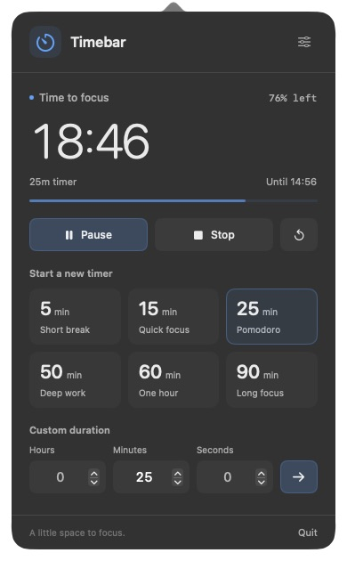
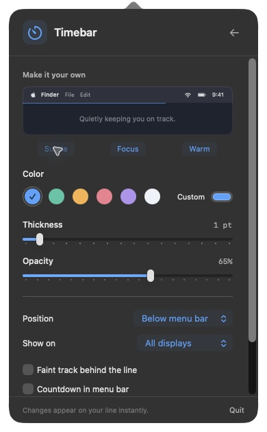

# Timebar

A quiet timer for your Mac's menu bar. Start a timer and a thin line appears below the menu bar. Its right edge moves left as time runs out. Glance up to see how much time remains.

Native Swift. No accounts, analytics, network requests, or third-party dependencies.

<p>
  
  
</p>

Timer controls and appearance settings from the current source build.

## Download

**[Download Timebar 1.0](https://github.com/velvet-shark/timebar/releases/latest)**

Requires **macOS 14 Sonoma or later**, including macOS 26 Tahoe. The universal download includes Apple silicon and Intel binaries. Interactive testing has been performed on Apple silicon; see [verification](VERIFICATION.md) for coverage.

1. Download the `Timebar-1.0.0-macOS-universal.zip` release asset and unzip it.
2. Drag `Timebar.app` to Applications and open it.
3. Click the timer icon in the menu bar. There is no Dock icon.

**The 1.0 download is ad hoc signed and has not been notarized by Apple.** macOS may block the first launch. If you trust this download, Apple's [instructions for opening an unnotarized app](https://support.apple.com/102445) explain the app-specific **Open Anyway** option in System Settings > Privacy & Security. A SHA-256 checksum accompanies the release. You can also build from source below. Developer ID signing and notarization are planned for a later release.

Updates are manual: quit Timebar, download the new version, and replace the app in Applications. Your preferences and timer remain saved.

## Use

- Start a preset immediately: 5, 15, 25, 50, 60, or 90 minutes.
- Set a custom duration from 1 second to 24 hours. Type into Hours, Minutes, and Seconds, or use the steppers and arrow keys. Press Return or the start arrow to begin.
- Open the menu to see the remaining time and percentage. Pause, resume, stop, or restart from there.
- Starting another timer replaces the current one. A paused timer leaves the line at its current width.
- At zero, the line disappears and the menu icon becomes a checkmark. An optional quiet sound marks completion.

## Make it yours

The current source defaults to Subtle: blue, 1 point thick, at 65% opacity. The v1.0 download still uses the earlier 2-point default. Choose a preset appearance or adjust the line yourself:

| Setting | Options |
| --- | --- |
| Thickness | 0.5 to 8 points, in half-point steps |
| Color | Six swatches or a custom color |
| Opacity | 10% to 100% |
| Position | Below the menu bar, top edge, or bottom edge |
| Displays | All displays or the primary display |
| Extras | Faint background track, menu bar countdown, completion sound |

On a Retina display, 0.5 points is one physical pixel. Standard-resolution displays use a one-pixel minimum. The overlay never intercepts clicks or takes keyboard focus.

With an auto-hidden menu bar, the default line stays below the normal menu area. Top-edge placement offers an alternative for full-screen work, respecting a MacBook's notch.

## Small by design

Timebar schedules updates around visible changes to the line, instead of continuously redrawing the interface. It creates the menu interface when opened and releases it when closed, while preserving your custom duration input. Idle and paused timers have no scheduled ticks. Sleeping displays keep only the completion callback.

Measurements, the profiling command, and testing limits are documented in [Performance](docs/PERFORMANCE.md). CPU and memory depend on the display, timer duration, visible controls, and macOS version; these measurements are not a battery-life guarantee.

## Timer behavior and privacy

The timer uses a saved deadline, so sleep and delayed callbacks do not accumulate drift. Quitting the app does not cancel a timer; **Stop** does. A running timer resumes from its deadline on relaunch. If it expired while the app was closed, Timebar shows it as finished without playing an old alert. A paused timer stays paused. Changing the system clock changes the deadline-based countdown.

All settings and timer state stay in local macOS preferences under `com.velvetshark.timebar`. Timebar has no server, telemetry, advertising, or background network service. It does not prevent sleep or require accessibility or screen-recording permissions.

To start it at login, first move it to Applications, then add it in System Settings > General > Login Items.

## Build from source

Install Xcode 16 or later with Swift 6. A single-architecture local build also works with matching Xcode Command Line Tools. The universal build requires full Xcode.

```sh
git clone https://github.com/velvet-shark/timebar.git
cd timebar
swift test
./scripts/run.sh
```

Build and package both Mac architectures:

```sh
./scripts/build-app.sh --universal
./scripts/package-release.sh
```

The app and ZIP are written to `dist/`. Builds use a local ad hoc signature by default. See [Distribution](docs/DISTRIBUTION.md) for the Developer ID signing and notarization workflow.

`TimebarCore` contains deterministic timer state, refresh scheduling, duration validation, appearance settings, and display geometry. `Timebar` contains the SwiftUI menu and AppKit status item and overlay. Timer arithmetic is separate from real clocks and UI, so it can be tested without sleeping or driving the desktop.

## Contributing

Bug reports and focused improvements are welcome. Include your macOS version, Mac architecture, display setup, and steps to reproduce. Please open an issue before proposing a substantial feature. Run `swift test` and `./scripts/build-app.sh` before submitting changes.

## License

[MIT](LICENSE). Copyright 2026 Radek Sienkiewicz.
